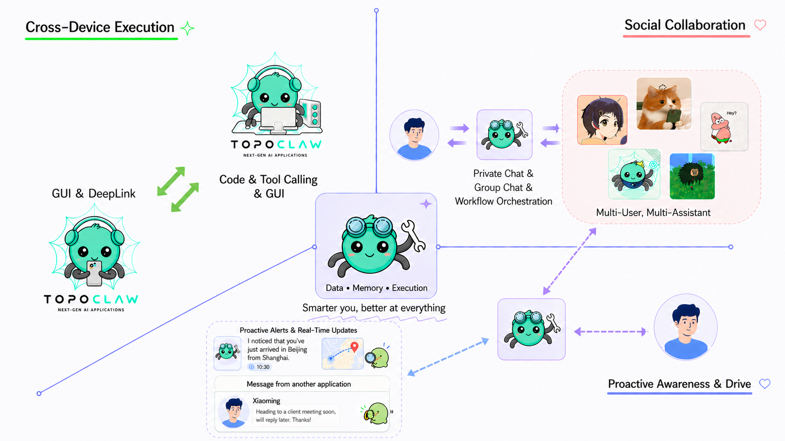
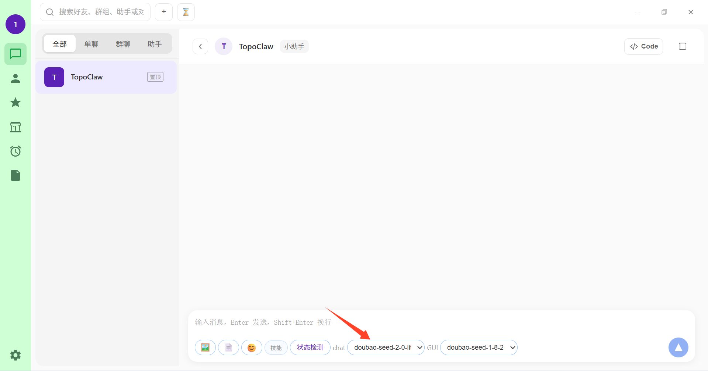

<div align="center">
  
  <h1 style="margin-top: 0.35em;">TopoClaw: Your All-Scenario AI Digital Assistant</h1>
</div>

<p align="center">
  <a href="#-what-is-topoclaw">About</a> •
  <a href="#-core-capabilities">Core Capabilities</a> •
  <a href="#-security">Security</a> •
  <a href="#-quick-start">Quick Start</a> •
  <a href="#️-roadmap">Roadmap</a> •
  <a href="#-faq">FAQ</a>
</p>

<p align="center">
  <a href="./README.md"><strong>English</strong></a> | <a href="./README_CN.md">中文</a>
</p>

<p align="center">
  
  
  
</p>

---

## 💡 What is TopoClaw?

TopoClaw is an open-source cross-device AI agent system for Android and Windows. It combines mobile-use, computer-use, GUI automation, social collaboration, proactive sensing, and customizable assistant skills into one personal AI assistant framework.

TopoClaw is your **AI digital assistant**. It's not just a chatbot — it's an assistant that can **operate your computer and phone, communicate and collaborate with others on your behalf, and proactively keep things moving when you're away**, continuously learning your preferences to become more like you over time.

This repository combines **`TopoMobile`** (mobile) and **`TopoDesktop`** (desktop) products together. You can use the default assistants directly, or create your own assistants and skills to accomplish complex tasks across devices and users.

Your assistant has these core capabilities:

- **🖥️📱 Cross-Device Execution**: Phone and computer form a unified execution surface — tasks can be decomposed, parallelized, and chained across devices, with outputs flowing automatically between steps
- **👥 Social Collaboration**: TopoClaw has a shareable social identity, can be invited into group chats to negotiate and get things done, can auto-create multi-user multi-assistant groups for collaborative problem-solving, and can help filter and reply to group and friend messages for you — while key decisions remain in your control
- **⚡ Proactively Sense & Drive**: Senses phone notifications, detects schedule conflicts, and proactively reports key conclusions — no need for you to keep asking
- **🔒 Security by design**: Three-tier file permissions + workspace isolation + command auditing — powerful but never out of control
- **🧩 Open and extensible**: Skill community + assistant marketplace + multi-channel access — capabilities are reusable, shareable, and customizable

<p align="center">
  
</p>

---

## 📢 News

- **[23 Apr 2026]** TopoClaw is now open source — core Agent framework, desktop client, mobile client, and communication backend released

---

## 🎬 Demo

### ▶️ Cross-Device Execution
> "There's a PDF called 'Labor Contract' on my computer — find the name and phone number of Party A, then send a text message asking when they're available."

https://github.com/user-attachments/assets/44438d42-34ab-47a7-91d3-3fc5c1a33596

### ▶️ Social Collaboration
> "Create a group called 'Team Hangout', invite my friend B, then ask if they're free for dinner sometime soon."

https://github.com/user-attachments/assets/3c19ace1-7d43-41e5-a33f-3f62aaf088ba

### ▶️ Proactive
> "I'm going to sleep. If Jack asks to schedule with me, tell him I'll arrive in Shenzhen at 9:00 AM tomorrow. I have a meeting after I arrive, and I'm available from 5:00 PM to 6:00 PM tomorrow."

https://github.com/user-attachments/assets/edeffd76-e138-4e50-8770-d5c2e4359d29

> 🎥 All demo videos above were accelerated, trimmed, and voiced over by TopoClaw itself.

---

## 🏆 Capability Comparison

<table>
  <thead>
    <tr>
      <th rowspan="2"></th>
      <th colspan="5" align="center">Cross-Device Execution</th>
      <th colspan="2" align="center">Social Collaboration</th>
      <th colspan="1" align="center">Proactive Sensing</th>
    </tr>
    <tr>
      <th>Mobile-use GUI</th>
      <th>Mobile DeepLink</th>
      <th>PC-Side Execution<br/>(Code &amp; Function Calling)</th>
      <th>Computer-use GUI</th>
      <th>Cross-Device<br/>Orchestration</th>
      <th>Digital Assistant</th>
      <th>Multi-User Multi-Agent<br/>Collaboration</th>
      <th>External<br/>Sensing</th>
    </tr>
  </thead>
  <tbody>
    <tr><td><strong>OpenClaw</strong></td><td>❌</td><td>❌</td><td>✅</td><td>❌</td><td>❌</td><td>❌</td><td>❌</td><td>❌</td></tr>
    <tr><td><strong>TopoClaw</strong></td><td>✅</td><td>✅</td><td>✅</td><td>✅</td><td>✅</td><td>✅</td><td>✅</td><td>✅</td></tr>
  </tbody>
</table>

---

## ✨ Core Capabilities

To truly represent you, your digital assistant needs three key abilities: ** execution across devices**, **communicate & collaborate on your behalf**, and **Proactively Sense & Drive**.

### 🖥️📱 Cross-Device Execution

You use both your computer and phone — so does your assistant. Under the same account, phone and computer form a **unified execution surface**, with sessions and results extending seamlessly across devices.

- **Operates both PC and phone**: Invokes PC-side capabilities (Code / tool calling / GUI, etc.) and mobile-side capabilities (GUI / DeepLink, etc.) based on scenario
- **Tasks orchestrated across devices**: Supports task orchestration, parallel sub-tasks, and chained execution — output from one step auto-feeds the next, regardless of device
- **Results auto-consolidated**: PC file system serves as the data hub; mobile results sync back seamlessly

### 👥 Social Collaboration

You need to deal with other people — so does your assistant. It can create groups, negotiate, and get things done on your behalf. In group and assistant marketplace scenarios, multiple users and assistants collaborate through admin-organized coordination, free-form discussion, and workflow orchestration, bringing real-world multi-person workflows into a unified space.

- **Your smartest AI assistant**: Continuously learns your preferences and habits, represents you to create groups, negotiate, and get things done — handles daily affairs as if it were you
- **Tiered Autonomy**: Tiered handling — routine inquiries → auto-filtered scheduling → authorization required for key decisions → sensitive matters handed off to you
- **From group creation to getting it done**: Supports auto group creation, seamless negotiation → execution, and proactive post-execution reporting — each role plays its part, workflows unfold naturally

### ⚡ Proactively Sense & Drive

When you're away, your assistant keeps watch — handling what it can and alerting you when needed. Within rules and security boundaries, it **proactively senses** task progress and external changes, advancing next steps.

- **Never misses what matters**: Filters important phone notifications, cross-references with memory context (e.g., detects schedule conflicts)
- **Reports before you ask**: Key conclusions delivered proactively, pauses with context when decisions are needed, alerts on anomalies
- **Fewer round-trips**: Works with long-term memory, scheduled tasks, and channel notifications to reduce back-and-forth

> Specific capabilities depend on product version and configuration.

### 🧩 Supporting Capabilities

| Capability | Description |
|---|---|
| **Skills Ecosystem** | Search and install skills from the community, or have the assistant generate and save them on demand; once added to "My Skills," they're auto-invoked in matching scenarios |
| **Group Collaboration** | Create groups, invite friends and different assistants; supports task division, joint execution, and @-mentioning specific assistants |
| **Assistant Marketplace** | Create, manage, and share your own assistants, or add others' capabilities via assistant ID |
| **Memory Enhancement** | Continuously learns preferences and common workflows, reducing repetitive explanations |
| **Multi-Channel Access** | Connect to various IM channels, reusing the same assistant capabilities |

---

## 🔒 Security

Your assistant can execute code on your computer, control your phone's UI, and communicate on your behalf — with great power comes great risk. To address this, we designed a strict security architecture that fully unleashes assistant capabilities while ensuring every layer has a safety net:

| Layer | Mechanism |
|---|---|
| **Three-Tier Permissions** | Fine-grained file system access control with Forbidden / Read-only / Editable levels, enforcing the principle of least privilege |
| **Workspace Isolation** | Configurable allowed operation scope; out-of-bounds actions trigger a user confirmation prompt, auto-denied on timeout |
| **Command Execution Auditing** | All exec commands checked in real time; automatically intercepts dangerous operations like file moves and deletions, preventing agents from bypassing protections via generic tools |

---

## 🚀 Quick Start

### One-Click Install

- Community-provided installation package: <https://github.com/huanggangyyd/topoclaw-thirdparty-builds/releases/tag/v2.1.0-thirdparty.1>

#### Basic Setup

1. **Download and install**
   Download the mobile APK and desktop EXE, then complete installation on Android and Windows respectively.
2. **Deploy the relay service**
   [Self-hosted] Download and deploy `customer_service` from this repository for cross-device and cross-user relay. After deployment, click "Service Settings" on the desktop login page, then enter your service domain in "Relay Service Domain";
   [Use built-in local service] Click "Service Settings" on the desktop login page, then click Save and Restart;
   
   After deployment, open the TopoClaw mobile app and scan the QR code (top-right of the home page) to connect to the corresponding relay service;
   If you run into issues, you can verify whether the service is bound successfully in:
   - Mobile app: `Me -> Services -> scroll to the bottom and check "Relay Service Domain"`
   - Desktop app: `Click Settings at the bottom-left -> check "Relay Service Domain"`
3. **Bind devices**
   Return to the desktop login page, tap Scan on the mobile app (top-right), then scan the desktop QR code to connect.
4. **Configure models**
  On PC, click the Settings button in the bottom-left corner, then configure the model under Global Model Configuration. There are two model categories:
   - `Chat`: for general tasks
   - `GUI`: for desktop/mobile GUI tasks (multimodal model)

<p align="center">
  
</p>

After these steps, the basic setup is complete.

#### Additional Important Mobile Permissions

- **Accessibility and screenshot permissions**: Required for mobile GUI action simulation. You can grant them only when such tasks are actually needed.
- **TopoClaw keyboard**: Dedicated keyboard for mobile GUI tap simulation; when running GUI tasks, switch keyboards as prompted.
- **Overlay permission**: After granting, enable "Allow overlay during tasks" and "Companion mode" (enabled by default, keeps the assistant ready in the foreground with a floating control for quick task handoff). A floating ball appears on your phone desktop; tap it to launch tasks.
- **Device and app notification permissions**: Required for notification monitoring; see **Proactive capabilities** under Core Capabilities below.

#### Core Capabilities

- **Cross-device execution**: After binding both phone and desktop, click "Status Check" below the TopoClaw chat input box. Once the check passes, you can start cross-device tasks.
  Note: GUI-related tasks may require manual permission authorization on mobile.
- **Cross-user execution**
  - **Digital twin**: In a private chat with a desktop-side friend, tap the top-right menu to enable "Digital Twin". Once enabled, TopoClaw can auto-handle and reply to friend messages, and ask for your intervention when needed.
  - **Group workflow**: Groups can include multiple users and assistants, created by either users or TopoClaw. Three orchestration modes are supported in the group profile:
    1) Free speaking mode: all users and assistants can speak freely based on context.
    2) Group manager assistant mode: disable "Workflow Orchestration", "Free Speaking", and "Mute Assistants" to enter this mode; the group manager assistant orchestrates message flow centrally.
    3) Workflow orchestration mode: tap the top-right corner in the group conversation page to enter workflow orchestration. It can be arranged manually by users or auto-arranged by TopoClaw. After setup, assistants in the group collaborate according to the workflow.
- **Proactive capabilities**
  - **Notification shade monitoring**: In the mobile app under "Services", enable "Monitor notification shade" and choose target contacts under "Notification monitoring allowlist"; TopoClaw can then respond automatically based on notifications.
  - **Proactive updates**: TopoClaw surfaces important context it observes (from other chats, groups, IM messages) directly in your TopoClaw conversation so you can handle busy inboxes faster.

#### Pages & Other Features

- **Contacts**: Your assistants, groups, and friends in one place.
- **Skills (desktop-only right now)**:
  **My Skills**: Skills currently available to TopoClaw.
  **Skill community**: Search and fetch skills directly from the open-source community.
  Note: Skills cannot be configured on mobile yet.
- **Assistants**:
  **My assistants**: Edit assistants you've created (including model settings), or create custom assistants from scratch.
  **Assistant Marketplace**: Browse and use assistants shared by friends.
- **Scheduled tasks**: View, edit, or create scheduled tasks.
- **Quick Notes (desktop-only right now)**: Lightweight scratchpad features — capture and summarize any region of your desktop screen anytime (shortcut `Ctrl + Alt + Q`), alongside chat excerpts with your assistant.
  Note: Quick Notes are supported on desktop only for now.

### 🛠️ Self-Hosting & Developer Guide

#### Developer Build / Run Commands

The following commands are for local development. Execute from the repository root by default.  
Note: TopoClaw and the relay service (embedded `customer_service`) are integrated into TopoDesktop during the TopoDesktop build process. For normal desktop usage, you do not need to deploy these two components separately.

##### Step 1 — customer_service (Communication Backend)

The conversation relay and state management service responsible for binding, message routing, friend/group relationships, and multi-device sync — the bridge between mobile and desktop.

If you choose self-hosting, use the commands below. Otherwise, on the desktop application login page, select the built-in local service (see [One-Click Install](#one-click-install) above).

```bash
cd customer_service
pip install -r requirements.txt
python app.py
# Or with uvicorn
uvicorn app:app --host 0.0.0.0 --port 8001
```

##### Step 2 — TopoMobile (Android Client)

The mobile application providing chat interaction, task-execution GUI, trajectory collection & replay, notification sensing, and more — the AI assistant's execution entry point on your phone.

Open `TopoMobile/` in Android Studio, connect your phone, and Run (`Shift + F10`). See `TopoMobile/README.md` for details.

##### Step 3 — TopoDesktop (Desktop, Windows CMD)

The desktop client sharing chat history with the mobile side, supporting IMEI / QR-code binding. Ships with embedded TopoClaw and relay service backends, ready to use out of the box.

```cmd
cd TopoDesktop
build-desktop-core-plus-browser.cmd
```

This command runs the full desktop build pipeline in one shot (dependency install, built-in resource sync, embedded Python setup, browser-use install, and Electron packaging).
For more installation and packaging options, see `TopoDesktop/README.md`.

#### Optional: Standalone Backend Debugging (Developers Only)

The following is only for secondary development or backend troubleshooting. For normal usage, use TopoDesktop directly (TopoClaw and the relay service are integrated during the TopoDesktop build process):

- **TopoClaw (Core Agent Framework)**
```bash
cd TopoClaw
pip install -e .
topoclaw onboard
topoclaw service --host 0.0.0.0 --port 18790
```

#### Reference Documentation

| Module | Description | Docs |
|---|---|---|
| **TopoClaw** | Core Agent framework | `TopoClaw/README.md` |
| **customer_service** | Communication backend (relay service) | `customer_service/README.md` |
| **TopoMobile** | Android client | `TopoMobile/README.md` |
| **TopoDesktop** | Desktop client | `TopoDesktop/README.md` |

---

## 🗺️ Roadmap

### ✅ Released

- **Cross-Device Execution**: Unified execution surface across phone and PC — task orchestration, parallel sub-tasks, and chained cross-device execution
- **Social Collaboration**: Digital assistant + group collaboration + assistant marketplace, with auto group creation and tiered behavior protocol
- **Proactively Sense & Drive**: Notification monitoring & smart judgment, proactive reporting, anomaly alerts
- **Skill system**: Skill creation, community installation, and auto-invocation loop
- **Security architecture**: Three-tier file permissions, workspace isolation, command execution auditing

### 📋 Planned

- English-language apps (localized mobile & desktop UX)
- Workflow flexibility enhancements
- Heterogeneous multi-device management
- More platform support (macOS / Linux desktop, iOS mobile)
- Team collaboration & permission management enhancements

---

## ❓ FAQ

**Q: Do I need to deploy all modules together?**

**A:**
No. In everyday use, TopoDesktop already embeds TopoClaw and the relay service, so you do not need to deploy TopoClaw separately again. Combine the rest as needed:
1. **Desktop-only**: TopoDesktop alone suffices
2. **Social collaboration**: TopoDesktop + `customer_service` (self-host **or** use the built-in local relay — note the built-in relay is LAN-only by default)
3. **Cross-device execution**: TopoDesktop + TopoMobile + `customer_service`

For secondary development or standalone debugging of the services, you can run TopoClaw manually — see **Optional: Standalone Backend Debugging (Developers Only)** above.

**Q: Which platforms are supported?**

**A:**
Currently the desktop client supports Windows only, and the mobile client supports Android only. macOS / Linux desktop and iOS mobile support are on the Roadmap — stay tuned.

**Q: Where is my data stored? Is it secure?**

**A:**
When using the local built-in environment, core data is processed locally first. The security architecture provides layered protection from data flow to operation permissions:
1. Some data from cross-device and social collaboration scenarios is relayed through the communication backend (customer_service), which can be self-hosted by the user
2. All other data is stored and processed locally
3. Any delete or write operation outside the designated workspace triggers a confirmation prompt — execution proceeds only after explicit user approval

For more security mechanisms, see the [Security](#-security) section.

**Q: Which LLMs does TopoClaw support?**

**A:**
Any model service compatible with the OpenAI API protocol (e.g., OpenRouter, DashScope, Azure OpenAI), plus OAuth login for OpenAI Codex and GitHub Copilot. See `TopoClaw/README.md` for configuration details.

**Q: Why can't my cross-device connection be established?**

**A:**
Please troubleshoot in this order:
1. In the TopoClaw chat page, click the **Status Check** button below the input box first.
2. If it fails, confirm both mobile and desktop apps are bound to `customer_service`, and make sure either network condition is met:
   - `customer_service` is reachable by both phone and PC from public network (IP tunneling / port mapping configured); or
   - `customer_service`, phone, and PC are in the same LAN (same Wi-Fi).
3. Check `customer_service/outputs/custom_assistants/custom_assistants.json`:
   - `topoclaw.baseUrl` for the current IMEI should be `topoclaw://relay`;
   - corresponding `custom_topoclaw.baseUrl` should be the reachable IP address of the desktop app's built-in service.
4. Restart the mobile app, desktop app, and `customer_service`, then test again.
5. If the issue persists, contact us anytime and include the Status Check result plus key logs for faster diagnosis.

---

## 📄 License

This project is licensed under the Apache License 2.0 — see the [LICENSE](LICENSE) file for details.

---

<p align="center">
  Feedback and ideas are always welcome — please open an Issue or start a discussion with us.<br/>
  We will continue iterating and shipping updates.
</p>

<p align="center">
  <strong>TopoClaw — Your all-scenario AI digital assistant.</strong>
</p>
