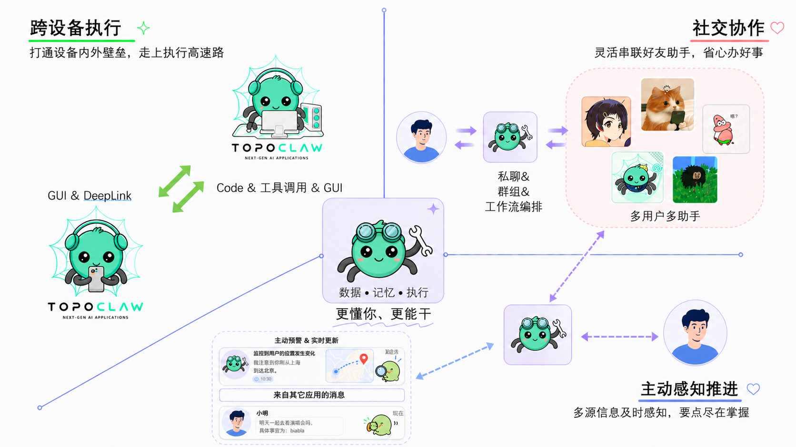

<div align="center">
  
  <h1 style="margin-top: 0.35em;">TopoClaw：你的全场景 AI 数字助手</h1>
</div>

<p align="center">
  <a href="#-topoclaw-是什么">简介</a> •
  <a href="#-核心能力">核心能力</a> •
  <a href="#-安全">安全</a> •
  <a href="#-快速开始">快速开始</a> •
  <a href="#️-roadmap">Roadmap</a> •
  <a href="#-常见问题">FAQ</a>
</p>

<p align="center">
  <a href="./README.md">English</a> | <a href="./README_CN.md"><strong>中文</strong></a>
</p>

<p align="center">
  
  
  
</p>

---

## 💡 TopoClaw 是什么？

TopoClaw 是一个开源跨设备 AI Agent 系统，面向 Android 手机与 Windows 桌面，支持 mobile-use、computer-use、GUI 自动化、社交协作、主动感知与自定义技能。

TopoClaw 是你的 **AI 数字助手**。它不只是一个聊天助手，而是一个能替你**操作电脑和手机、代你与他人沟通协作、在你不在时主动盯着事情推进**的助手，并在每次交互中持续学习你的偏好，越来越像你。

本仓库将**手机端 `TopoMobile`** 与**电脑端 `TopoDesktop`** 等产品组合在一起，你可以直接使用默认助手，也可以创建自己的助手与技能，在多端、多人场景里完成复杂任务。

你的助手具备以下核心能力：

- **🖥️📱 跨设备执行**：手机与电脑组成统一执行面，任务可拆解、并行、链式跨端执行，上一步输出自动流入下一步
- **👥 社交协作**：TopoClaw 拥有可分享的社交身份，可被邀请进群参与协商办事，亦能自动组建多用户多助手群组协作解决问题；可帮你自动过滤并回复群组与好友消息，关键决策仍由你掌控
- **⚡ 主动感知推进**：能感知手机通知、检测日程冲突、主动汇报关键结论，不用你反复追问
- **🔒 安全兜底**：三级文件权限 + 操作空间隔离 + 命令审计，能力强但不失控
- **🧩 开放可扩展**：技能社区 + 助手广场 + 多渠道接入，能力可复用、可分享、可定制

<p align="center">
  
</p>

---

## 📢 News

- **[2026 年 4 月 23 日]** TopoClaw 正式开源，发布核心 Agent 框架、桌面端、手机端与通讯后端服务

---

## 🎬 Demo

### ▶️ 跨设备执行
> "我电脑上有一个叫劳务合同的pdf，你帮我找一找里面甲方的姓名和电话，然后发条短信问他什么时候有时间"

https://github.com/user-attachments/assets/44438d42-34ab-47a7-91d3-3fc5c1a33596

### ▶️ 社交协作
> "帮我创个群，叫'内部小聚群'，拉好友小B进来，然后问他最近有没有时间一起共进晚餐。"

https://github.com/user-attachments/assets/3c19ace1-7d43-41e5-a33f-3f62aaf088ba

### ▶️ 主动感知
> "我去睡觉去了，如果jack来约我时间，告诉他我明天早上九点到深圳，到了深圳有个会，明天下午五点到六点有空"

https://github.com/user-attachments/assets/edeffd76-e138-4e50-8770-d5c2e4359d29

> 🎥 以上 Demo 视频的加速、裁剪、配音均由 TopoClaw 自身完成。

---

## 🏆 能力对比

<table>
  <thead>
    <tr>
      <th rowspan="2"></th>
      <th colspan="5" align="center">跨设备执行</th>
      <th colspan="2" align="center">社交协作</th>
      <th colspan="1" align="center">主动感知</th>
    </tr>
    <tr>
      <th>Mobile-use GUI</th>
      <th>手机侧 DeepLink</th>
      <th>电脑侧执行<br/>(Code &amp; Function Calling)</th>
      <th>Computer-use GUI</th>
      <th>跨设备复杂编排</th>
      <th>数字助手</th>
      <th>多用户多智能体<br/>协作执行</th>
      <th>外界感知</th>
    </tr>
  </thead>
  <tbody>
    <tr><td><strong>OpenClaw</strong></td><td>❌</td><td>❌</td><td>✅</td><td>❌</td><td>❌</td><td>❌</td><td>❌</td><td>❌</td></tr>
    <tr><td><strong>TopoClaw</strong></td><td>✅</td><td>✅</td><td>✅</td><td>✅</td><td>✅</td><td>✅</td><td>✅</td><td>✅</td></tr>
  </tbody>
</table>

---

## ✨ 核心能力

数字助手要真正代表你办事，需要三项关键能力：**跨设备执行**、**社交协作**、**主动感知推进**。

### 🖥️📱 跨设备执行

你用电脑也用手机，助手也得两端都能操作。同一账号下手机与电脑组成**统一执行面**，会话与结果跨端延续。

- **电脑手机都能操作**：按场景调用电脑侧能力（Code / 工具调用 / GUI 等）与手机侧能力（GUI / DeepLink 等）
- **任务编排跨端跑**：支持任务编排、并行子任务与链式执行——上一步输出自动流入下一步，不受设备限制
- **结果自动汇总**：PC 文件系统作为数据中枢，手机结果无缝回传

### 👥 社交协作

你需要和别人打交道，助手也得能建群、协商、办事。群组与助手广场等场景下，多用户、多助手通过管理员组织、自由发言、工作流编排等多种协作形式，把现实里需要多人配合的流程搬进同一套协作空间。

- **最懂你的 AI 助手**：持续学习你的偏好与习惯，能代表你建群、协商、办事，像你本人一样处理日常事务
- **分级自治边界清晰**：分级处理——日常咨询直接回复 → 日程协调自动筛选方案 → 关键决策必须授权 → 敏感事项转交本人
- **建群到办完一条龙**：支持自动建群、协商→执行无缝衔接、执行后主动汇报，群内角色各司其职、流程自然流转

### ⚡ 主动感知推进

你不在的时候，助手得自己盯着，有事主动处理或提醒你。在规则与安全边界内**主动感知**任务进展与外界变化，推进后续步骤。

- **重要消息不漏掉**：过滤手机重要通知，与记忆上下文交叉比对（如检测日程冲突）
- **有结论主动说**：关键结论不等你问、需要决策时暂停并附上下文、异常情况及时预警
- **少问你几遍**：与长期记忆、定时与渠道通知等能力配合，减少「逐项追问」式的往返

> 具体能力以产品版本与配置为准。

### 🧩 配套能力

| 能力 | 说明 |
|---|---|
| **技能闭环与社区** | 从社区检索安装技能，或让助手按需生成并保存；加入"我的技能"后可在合适场景自动调用 |
| **群组协作** | 创建群组并邀请好友与不同助手加入，支持任务分工、联合执行与按需 @ 指定助手 |
| **助手广场** | 创建、管理并分享自己的助手，也可通过助手 ID 添加他人的助手能力 |
| **记忆增强** | 持续学习偏好与常用流程，减少重复说明 |
| **多渠道接入** | 可接入多种 IM 等渠道，复用同一套助手能力 |

---

## 🔒 安全

助手能在电脑上执行代码、在手机上操控界面、代你社交沟通——能力越大，潜在风险也越大。为此我们设计了严格的安全架构，在充分释放助手能力的同时，确保每一层都有安全兜底：

| 层级 | 机制 |
|---|---|
| **三级权限体系** | 文件系统权限精细化管控，支持禁止 / 只读 / 可编辑三级配置，实现最小权限原则 |
| **操作空间隔离** | 可配置允许的操作空间范围；越界操作自动弹出用户确认，超时默认拒绝 |
| **命令执行审计** | 所有 exec 命令实时检查，自动拦截文件移动、删除等危险操作，防止智能体通过通用工具绕开防护 |

---

## 🚀 快速开始

### 一键安装

- 来自社区的安装包：<https://github.com/huanggangyyd/topoclaw-thirdparty-builds/releases/tag/v2.1.0-thirdparty.1>

#### 基础配置

1. **下载并安装**  
   下载手机端 APK 与电脑端 EXE，分别在 Android 和 Windows 上完成安装。
2. **部署中转服务**  
   【自行部署】下载并部署原仓库中的 `customer_service`，用于建立跨设备、跨用户的中转服务；部署完成后，在电脑端登录页面点击“服务设置”，在“中转服务域名”输入栏内输入服务域名。  
   【使用本地内置服务】在电脑端登录页面点击“服务设置”，点击保存并重启。  
   完成上述任一方式的配置后，打开 TopoClaw 手机版扫码（主页右上角）即可连接到对应中转服务；  
   如果遇到问题，您可以到如下位置检查服务是否绑定成功：  
   - 手机端：`我 -> 服务 -> 下滑到底部检查“中转服务域名”`
   - 电脑端：`点击左下角设置 -> 检查“中转服务域名”`
3. **绑定设备**  
   电脑端返回登录页后，点击手机端右上角“扫一扫”，扫描电脑端二维码完成连接。
4. **模型配置**  
   电脑端点击左下角设置按钮，在 “全局模型配置” 配置模型。模型分为两类：  
   - `Chat`：面向通用任务  
   - `GUI`：面向电脑端/手机端 GUI 任务（多模态大模型）  
   配置完成后，返回与 TopoClaw 的会话，即可在下图所示位置选择模型。  

<p align="center">
  
</p>

至此，基础配置完成。

#### 手机端额外重要权限

- **无障碍权限、截图权限**：用于手机 GUI 模拟点击，仅在执行相关任务时需要，无需提前授权。
- **TopoClaw 键盘**：手机 GUI 模拟点击专用键盘，在执行 GUI 任务时，请根据提示进行切换。
- **悬浮窗权限**：授权后请开启“任务允许悬浮窗”与“开启伴随模式”（默认开启，用于保持助手在前台待命并提供悬浮控件，便于快速接管任务），桌面会出现悬浮球，点击即可发起任务。
- **设备和应用通知权限**：用于通知栏监视能力，详见本节「核心能力」中的「主动能力」说明。

#### 核心能力

- **跨设备执行**：绑定手机和电脑后，TopoClaw 会话详情页上方小灯泡亮起即代表连接成功可以发起跨设备任务（您也可以手动点击小灯泡重连）。  
  注意：涉及 GUI 的任务可能需要在手机端手动授权相关权限。
- **跨用户执行**  
  - 数字分身：在与电脑端好友的私聊页，点击右上角可开启“数字分身”。开启后，TopoClaw 会自动处理好友消息、进行回复，并在需要你介入时及时求助。  
  - 群组：群组由多用户、多助手组成，可由用户或 TopoClaw 发起。支持三种编排方式，可在群组主页配置：  
    1) 自由发言模式：所有用户与助手均可基于上下文自由发言。  
    2) 群组管理助手模式：取消勾选“工作流编排”“自由发言”“助手禁言”后进入；由群组管理助手统一编排消息流程。群组管理助手可由用户指定，或由 TopoClaw 自动设置。  
    3) 工作流编排模式：点击群组会话页右上角进入工作流编排；可由用户手动编排，或由 TopoClaw 代为编排。完成后，群内助手将按工作流协同执行。
- **主动能力**  
  - **手机通知栏监视**：在手机端“服务”页面开启“监视通知栏”，并在“设置通知监视白名单”中选择目标用户后，TopoClaw 可基于通知自动响应。  
  - **主动结论反馈**：TopoClaw 会将其接触到的重要信息（如其他好友、群组、IM 消息）主动同步到你与 TopoClaw 的会话中，帮助你更高效地处理繁杂消息。

#### 页面与其他功能

- **通讯录**：展示你的助手、群组、好友列表。
- **技能（该功能当前仅电脑端可用）**：  
  我的技能：当前 TopoClaw 可使用的技能；  
  技能社区：可通过搜索并从开源社区直接获取技能。  
  注意：手机端暂不支持技能配置。
- **助手**：  
  我的助手：编辑已创建助手（含模型配置），也可新建自定义助手；  
  助手广场：查看并使用好友分享的助手。
- **定时任务**：查看、编辑、新建定时任务。
- **随手记（该功能当前仅电脑端可用）**：备忘录功能，可随时记录并总结电脑屏幕的任意区域（快捷键 `Ctrl + Alt + Q`），以及你与助手的聊天信息。  
  注意：随手记当前仅支持电脑端。

### 🛠️ 自部署与开发者入口

#### 开发者启动 / 编译命令示例

以下命令用于本地开发联调，默认在仓库根目录 `TopoClaw/` 下执行。  
说明：TopoClaw 与中转服务（内嵌 `customer_service`）在编译 TopoDesktop 时会被合入 TopoDesktop，常规桌面端使用无需单独部署这两个部分。

##### Step 1 — customer_service（通讯后端服务）

会话中转与状态管理服务，负责绑定、消息路由、好友/群组关系、多端同步等，是手机端与电脑端通信的桥梁。

若您选择自行部署，可使用下列命令；否则可在电脑应用登录页面选择本地内置服务（参见上方【一键安装】）。

```bash
cd customer_service
pip install -r requirements.txt
python app.py
# 或使用 uvicorn
uvicorn app:app --host 0.0.0.0 --port 8001
```

##### Step 2 — TopoMobile（Android 客户端）

移动端应用，提供聊天交互、任务执行 GUI、轨迹采集与回放、通知感知等能力，是 AI 助手在手机上的执行入口。

推荐使用 Android Studio 打开 `TopoMobile/`，连接手机后直接 Run（`Shift + F10`）。详细步骤见 `TopoMobile/README.md`。

##### Step 3 — TopoDesktop（桌面端，Windows CMD）

桌面客户端，与手机端共享聊天记录，支持 IMEI / 扫码绑定。内嵌 TopoClaw 与 中转服务 后端，开箱即用。

```cmd
cd TopoDesktop
build-desktop-core-plus-browser.cmd
```

该命令会一键执行桌面端完整打包流程（安装依赖、同步内置资源、配置内嵌 Python、安装 browser-use、执行 Electron 打包）。
更多安装与打包方式可参考 `TopoDesktop/README.md`。

#### 可选：服务侧独立调试（仅开发者）

以下内容仅用于二次开发或服务侧问题定位；常规使用请直接通过 TopoDesktop（已内嵌）：

- **TopoClaw（核心 Agent 框架）**
```bash
cd TopoClaw
pip install -e .
topoclaw onboard
topoclaw service --host 0.0.0.0 --port 18790
```

#### 参考文档

| 模块 | 说明 | 文档 |
|---|---|---|
| **TopoClaw** | 核心 Agent 框架 | `TopoClaw/README.md` |
| **customer_service** | 通讯后端服务（中转服务） | `customer_service/README.md` |
| **TopoMobile** | Android 客户端 | `TopoMobile/README.md` |
| **TopoDesktop** | 桌面客户端 | `TopoDesktop/README.md` |

---

## 🗺️ Roadmap

### ✅ 已发布

- **跨设备执行**：手机与电脑统一执行面，支持任务编排、并行子任务与链式跨端执行
- **社交协作**：数字助手 + 群组协作 + 助手广场，支持自动建群与分级行为协议
- **主动感知推进**：通知监听与智能研判、主动汇报、异常预警
- **技能系统**：技能创建、社区安装、自动调用闭环
- **安全架构**：三级文件权限、操作空间隔离、命令执行审计

### 📋 计划中

- 英语版应用（手机与电脑）
- 工作流灵活性增强
- 多异构设备管理
- 更多平台支持（macOS / Linux 桌面端、iOS 移动端）
- 团队协作与权限管理增强

---

## ❓ 常见问题

**Q: 必须同时部署所有模块吗？**

**A:**
不需要。常规使用场景下，TopoDesktop 已内嵌 TopoClaw 与中转服务，无需再单独部署 TopoClaw。其余模块按需组合：
1. **只需桌面端体验**：仅 TopoDesktop 即可
2. **需要社交协作**：TopoDesktop + customer_service(可自行部署或使用本地内置服务，但需注意本地内置服务默认只支持局域网)
3. **需要跨设备执行**：TopoDesktop + TopoMobile + customer_service
如需二次开发或独立调试服务，可手动启动 TopoClaw（参见上文「可选：服务侧独立调试」）。

**Q: 支持哪些平台？**

**A:**
目前桌面端仅支持 Windows，手机端仅支持 Android。macOS / Linux 桌面端及 iOS 移动端支持已在 Roadmap 中，敬请期待。

**Q: 数据存在哪里？安全吗？**

**A:**
使用本地内置环境时，核心数据优先在本地处理；安全架构从数据流转到操作权限逐层保障：
1. 跨设备执行、社交协作等场景的部分数据会通过通讯后端服务（customer_service）中转，该服务可由用户自行部署
2. 其余数据均在本地存储与处理
3. 对于非工作区的文件删除、写入等操作，系统会弹出确认提示，需用户明确许可后才会执行

更多安全机制详见[安全](#-安全)板块。

**Q: TopoClaw 支持哪些大模型？**

**A:**
支持所有兼容 OpenAI API 协议的模型服务（如 OpenRouter、DashScope、Azure OpenAI 等），也支持 OAuth 登录 OpenAI Codex 和 GitHub Copilot。具体配置见 `TopoClaw/README.md`。

**Q: 为什么跨设备连不通？**

**A:**
请按以下顺序排查：
1. 在 TopoClaw 会话页先点击输入框下方的**状态检测**按钮。
2. 若检测失败，确认手机端和电脑端都已成功绑定 `customer_service`，并确认网络满足以下任一条件：
   - `customer_service` 对手机和电脑均可公网访问（已做 IP 穿透/映射）；或
   - `customer_service`、手机、电脑在同一局域网（同一 Wi-Fi）下。
3. 检查 `customer_service/outputs/custom_assistants/custom_assistants.json`：
   - 当前 IMEI 对应的 `topoclaw.baseUrl` 应为 `topoclaw://relay`；
   - 对应的 `custom_topoclaw.baseUrl` 应为当前电脑端应用内置服务的可访问 IP 地址。
4. 重启手机端应用、电脑端应用和 `customer_service` 服务后再次测试。
5. 如仍失败，请随时联系我们并附上状态检测结果与关键日志，便于快速定位问题。

---

## 📄 许可证

本项目基于 Apache License 2.0 开源 — 详见 [LICENSE](LICENSE) 文件。

---

<p align="center">
  欢迎随时提交 Issue 或与我们讨论你的想法。<br/>
  我们会持续迭代并更新。
</p>

<p align="center">
  <strong>TopoClaw — 你的全场景 AI 数字助手。</strong>
</p>
